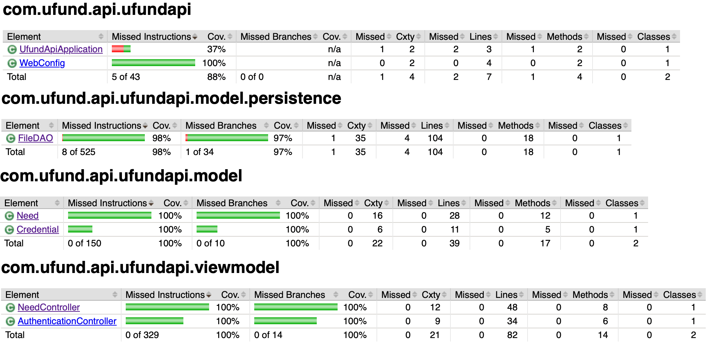

# PROJECT Design Documentation

> _The following template provides the headings for your Design
> Documentation.  As you edit each section make sure you remove these
> commentary 'blockquotes'; the lines that start with a > character
> and appear in the generated PDF in italics but do so only **after** all team members agree that the requirements for that section and current Sprint have been met. **Do not** delete future Sprint expectations._

## Team Information
* Team name: Autobots
* Team members
  * Johanna Wichmann
  * Conner Meagher
  * Isaac Ingram
  * Darius Nakis

## Executive Summary
We are making a website for Foodlink, a foodbank in Rochester, New York. 

### Purpose
>  _**[Sprint 2 & 4]** Provide a very brief statement about the project and the most
> important user group and user goals._
The purpose of our website is to give Foodlink a platform to request help with needs they have. Users will be able to look at a cupboard of needs that Foodlink is looking to have fulfilled. Those users can select a variable quantity of each Need and "checkout" when they would like to donate to Foodlink. 

### Glossary and Acronyms
| Term | Definition                                    |
|------|-----------------------------------------------|
| SPA  | Single Page                                   |
| MVP  | Minimum viable product                        |
| Need | Anything that Foodlink needs to be fulfilled  |
| API  | Application programming interface             |
| REST | Representational State Transfer               |

## Requirements
- User can login with username/password as an admin or a helper
- Users can create accounts
- Users can reset their passwords
- Admin can add needs to the cupboard
- Admins can not see user baskets
- Helper can select needs from the cupboard to add to their basket
- Helper can checkout needs from their basket
- Helper's basket persists even after they logout

### Definition of MVP
> _**[Sprint 2 & 4]** Provide a simple description of the Minimum Viable Product._
For sprint 2, our MVP includes a working basket that you can add and remove items from, a working login to allow admin and helpers to login seperately, and a cupboard that stores needs and allows them to move into and out of cart. 

### MVP Features
>  _**[Sprint 4]** Provide a list of top-level Epics and/or Stories of the MVP.

In the MVP, there were 4 important Epics that were needed to be implemented at the top level.

  1. The basket is needed to keep all needs that have been added for that user. The basket also needs to include a remove need feature incase the user wants to remove a certain amount of a certain need that was added. Finally, when a user is done recieving all the needs they want, they should be able to checkout and have all needs cleared from the basket.

  2. The User must be able to go into the cupboard and look at all needs present. To do this, it required all need functionality to be implemented from sprint 2. This includes adding a single need, adding a certain quantity of a single type of need, and searching a need. This will help the user to be able to get any need they want so that it can be added to their basket.

  3. The admin must be able to have a seperate cupboard so that the admin can add a new need to the cupboard that the user can see and remove any need from the user cupboard. This is necessary so that the cupboard can stay up to date and organized for whenever any new or already existing users are using the website.

  4. The login page is very important. This helps the person logging in to sign in as a user or as an admin. This helps differentiate the type of account so that the user can see a different cupboard than the admin cupboard. It is very simple implmementation, but was enhanced in sprint 3 by implementing authentication use and keeping track of a password.

### Enhancements
> _**[Sprint 4]**

For the enhancements, we have implemented two different kinds that were  not related to statistics at all.

    1. The first one was an accouint authentication system. The authentication system makes sure that when a user logs in, that the account was already created for and that it stores all information of that account like basket persistance, username, password, etc. This is done through storing data in a JSON file that has every user's password and username so that when a request is made from the frontend to login, then it checks if the username and password matches. 

    2. The other enhancement is a forgot password so that when a user forgets their password, they can remake their password with a new copy that replaces the old password in the JSON file.

## Application Domain

This section describes the application domain.

> _**[Sprint 2 & 4]** Provide a high-level overview of the domain for this application. You
> can discuss the more important domain entities and their relationship
> to each other._
For sprint 2, we worked on the login, basket, and cupboard part of the domain. The login component is where a user is differentiated as either a helper or an admin. When a helper logs in, they can view needs and add them to their cart and remove them from their cart. Helpers are the ones that are purchasing needs to fund the organization. When an admin logs in, they can edit the needs in the cupboard. The basket component is where a helper can see what they have added to their cart and they can edit it there. A helper can remove items from their cart or increase/decrease the quanitity of the item they have chosen. AN admin cannot see what is in helpers carts. From the basket component there is also the checkout button that removes the items that are checked out from the cupboard count. Finally the cupboard which is where all the needs are displayed. Helpers can view the cupboard and search for needs and add them to the basket. Admins can edit the cupboard and put in more needs or remove needs that are no longer needed. 

## Architecture and Design

This section describes the application architecture.

### Summary

The following Tiers/Layers model shows a high-level view of the webapp's architecture. 
**NOTE**: detailed diagrams are required in later sections of this document.
> _**[Sprint 1]** (Augment this diagram with your **own** rendition and representations of sample system classes, placing them into the appropriate M/V/VM (orange rectangle) tier section. Focus on what is currently required to support **Sprint 1 - Demo requirements**. Make sure to describe your design choices in the corresponding _**Tier Section**_ and also in the _**OO Design Principles**_ section below.)_

The web application, is built using the Model–View–ViewModel (MVVM) architecture pattern. 

The Model stores the application data objects including any functionality to provide persistance. 

The View is the client-side SPA built with Angular utilizing HTML, CSS and TypeScript. The ViewModel provides RESTful APIs to the client (View) as well as any logic required to manipulate the data objects from the Model.

Both the ViewModel and Model are built using Java and Spring Framework. Details of the components within these tiers are supplied below.

### Overview of User Interface

This section describes the web interface flow; this is how the user views and interacts with the web application.

> _Provide a summary of the application's user interface.  Describe, from the user's perspective, the flow of the pages in the web application._
A user will enter the login page which will make them login as either a admin or a helper. From their, they can go to the cupboard to add things to their basket or to their basket to edit the things they have selected to put into their basket. 

### View Tier
> _**[Sprint 4]** Provide a summary of the View Tier UI of your architecture.
> Describe the types of components in the tier and describe their
> responsibilities.  This should be a narrative description, i.e. it has
> a flow or "story line" that the reader can follow._

> _**[Sprint 4]** You must  provide at least **2 sequence diagrams** as is relevant to a particular aspects 
> of the design that you are describing.  (**For example**, in a shopping experience application you might create a 
> sequence diagram of a customer searching for an item and adding to their cart.)
> As these can span multiple tiers, be sure to include an relevant HTTP requests from the client-side to the server-side 
> to help illustrate the end-to-end flow._

> _**[Sprint 4]** To adequately show your system, you will need to present the **class diagrams** where relevant in your design. Some additional tips:_
 >* _Class diagrams only apply to the **ViewModel** and **Model** Tier_
>* _A single class diagram of the entire system will not be effective. You may start with one, but will be need to break it down into smaller sections to account for requirements of each of the Tier static models below._
 >* _Correct labeling of relationships with proper notation for the relationship type, multiplicities, and navigation information will be important._
 >* _Include other details such as attributes and method signatures that you think are needed to support the level of detail in your discussion._

### ViewModel Tier
Within our viewmodel, we have our REST API and the Service. Our REST API uses spring framework and uses the NeedController as its platform. Service uses UFundAPIApplication as its framework and the WebConfig as its platform. Both of these can use any operating system or hardware to run.

> _**[Sprint 4]** Provide a summary of this tier of your architecture. This
> section will follow the same instructions that are given for the View
> Tier above._

> _At appropriate places as part of this narrative provide **one** or more updated and **properly labeled**
> static models (UML class diagrams) with some details such as critical attributes and methods._
> 

### Model Tier
Within our model, we have the Model and the Persistence. Our model contains the main Needs file that defines a need and all of the functions Needs does. Our Persistence for Needs uses the NeedDAO and the FileDAO. The NeedDAO is the interface for the FileDAO to use to help implement all of its functions. Our model also contains the Credential file that defines a credential and all of the functions Credential does. Our persistence for Credentials uses the AuthenticationDAO and the File DAO. THe AuthenticationDAO is the interface for hte FileDAO to use to help implement all of its functions

> _**[Sprint 2, 3 & 4]** Provide a summary of this tier of your architecture. This
> section will follow the same instructions that are given for the View
> Tier above._

> _At appropriate places as part of this narrative provide **one** or more updated and **properly labeled**
> static models (UML class diagrams) with some details such as critical attributes and methods._
> 

## OO Design Principles

We used low coupling as a design principle between the NeedDAO and the NeedFileDAO. This allowed us to use an interface, the NeedDAO, to implement the functions in another file, the NeedFileDAO. It helps us to stay organized and know which file is having problems with the separation of the two. We also used single responsibility for our functions. Each function in the API only computes one function at a time. Our creatNeed only creates a need and nothing else. It allows the API to not have to worry about what’s going on around the rest of the program and just what is going on in that single function. We use the information expert like in our AccessControlService is in control of all of the information about the login process and who the user is. We use the Law of Demeter in our project as shown by our use of components and how everything is very seperated from each other. Take for example the LoginComponent. The only thing outside of the LoginCompenent that anything in the LoginComponent talks to is the AccessControlService. Everything else is dealt with only in the LoginComponent.

> _**[Sprint 2, 3 & 4]** Will eventually address upto **4 key OO Principles** in your final design. Follow guidance in augmenting those completed in previous Sprints as indicated to you by instructor. Be sure to include any diagrams (or clearly refer to ones elsewhere in your Tier sections above) to support your claims._

> _**[Sprint 3 & 4]** OO Design Principles should span across **all tiers.**_

## Static Code Analysis/Future Design Improvements
While looking at the Static Code Analysis tool, we found that the only issues in our code was that the CSS files for some of the components have not been filled out. This effects future maintanibility but is not a structural issue. Additionally I found that the front end does not have attiquite testing coverage which we should look at in the future.
Looking to the future, we should fill in the CSS files and add more front end testing.
> _**[Sprint 4]** With the results from the Static Code Analysis exercise, 
> **Identify 3-4** areas within your code that have been flagged by the Static Code 
> Analysis Tool (SonarQube) and provide your analysis and recommendations.  
> Include any relevant screenshot(s) with each area._

> _**[Sprint 4]** Discuss **future** refactoring and other design improvements your team would explore if the team had additional time._

## Testing
Our testing tests all functions within the API. All testing is functional for both the File DAO and the Controller.

### Acceptance Testing
> _**[Sprint 2 & 4]** Report on the number of user stories that have passed all their
> acceptance criteria tests, the number that have some acceptance
> criteria tests failing, and the number of user stories that
> have not had any testing yet. Highlight the issues found during
> acceptance testing and if there are any concerns._
Our NeedsControllers that includes createNeed, updateNeed, getNeed, deleteNeed, searchNeeds, and getNeeds is fully tested and passed all tests. 

Our AuthenticationControllers that includes createCredential, updateCredential, and getCredential is fully tested and passed all tests.

Our Need and Credential classes are completely tested.

Our FileDAO is completely tested, with the exception of the load() function which has some vulnerabilities that can't be tested.

### Unit Testing and Code Coverage
> _**[Sprint 4]** Discuss your unit testing strategy. Report on the code coverage
> achieved from unit testing of the code base. Discuss the team's
> coverage targets, why you selected those values, and how well your
> code coverage met your targets._

>_**[Sprint 2 & 4]** **Include images of your code coverage report.** If there are any anomalies, discuss
> those._

Our NeedFileDAO is not fully tested but when we add a few more tests it should be at 100% coverage.
Sprint 4: All unit testing for the NeedFileDAO is fully tested and finished adding the extra test. The test coverage is at 100%.

## Ongoing Rationale
2/21/24: Sprint 1 completed
3/20/24: Sprint 2 completed
4/8/24: Sprint 3 completed
